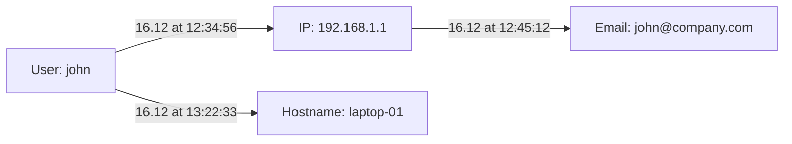

# Individual Mermetro - Group Timeline Analyzer

Individual Mermetro on erikoistunut työkalu, joka ottaa Mermetron tuottamat JSON-tiedostot ja luo yksityiskohtaisen timeline-visualisoinnin yhdestä valitusta ryhmästä.

## Toiminnallisuus

- **Ryhmän valinta**: Näyttää kaikki Mermetron löytämät ryhmät (ID_1, ID_2, jne.)
- **Timeline-visualisointi**: Luo flowchart LR-kaavion joka näyttää kronologisesti kuinka ryhmä muodostui
- **Timestampit yhteyksissä**: Näyttää tarkat aikaleimät yhteyksien välissä
- **Interaktiivinen**: Klikkaamalla nodea näkee kaikki sen tiedot
- **Merge-historia**: Näyttää kuinka ja miksi ryhmät yhdistyivät

## Käyttö

1. **Käynnistä ohjelma**:
   ```bash
   cd individual_mermetro
   python individual_mermetro.py
   ```

2. **Valitse JSON-tiedosto**: Sama tiedosto jota käytät Mermetrossa

3. **Valitse ryhmä**: Ohjelma näyttää listan kaikista ryhmistä:
   ```
   (1) ID_1 - 15 entries, 3 nodes
   (2) ID_2 - 8 entries, 2 nodes
   (3) ID_3 - 25 entries, 5 nodes
   ```

4. **Käy web-sivulla**: `http://localhost:5001`

## Output

### Timeline Format


### Tiedostot
- `timeline_koodi.txt` - Mermaid-koodi
- `group_timeline.html` - Staattinen HTML-tiedosto

## Ero Mermetroon

| Mermetro | Individual Mermetro |
|----------|-------------------|
| Näyttää kaikki ryhmät metrokartassa | Näyttää yhden ryhmän yksityiskohtaisesti |
| Metrokartta-visualisointi | Timeline flowchart LR |
| Yleiskuva | Syväsukellus |
| Portti 5000 | Portti 5001 |

## Tekniset vaatimukset

Sama kuin Mermetrossa:
- Python 3.x
- Flask
- Watchdog
- Pytz
- Multiprocessing

## API-endpointit

- `GET /` - Pääsivu
- `GET /api/timeline` - Timeline-sisältö
- `GET /api/groups` - Saatavilla olevat ryhmät
- `GET /api/select-group/<id>` - Valitse ryhmä
- `GET /api/node-details/<id>` - Noden tiedot
